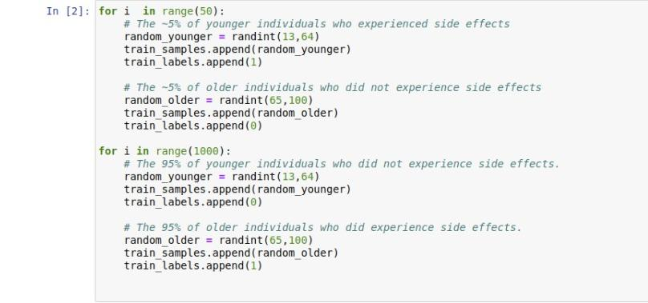

## About

In this repository, I created a tf.keras.Sequential model and trained it on a random generated data set. Ultimately, the goal of this model is to tell us whether or not a patient will experience side effects solely based on the patient's age.

## Prerequisite
Before you get to work on this project, it's recommended that you have a relevant environment.
In this case, I used Anaconda to set up the environment.(*Consider installing Anaconda  if you haven't had it installed already*)
Secondly, Jupyter Notebook or Colab Notebook are just great if used. However, you can still use an IDE of your choice.

### Set-Up and Pre-installation Guide
With Anaconda installed we'll need to set up our environment in our desired directory on the local machine using the command below on the terminal or cmd (*This environment will have tensorflow for CPU intalled in it*):

- `conda create -n <environment name> tensorflow`

Once created, activate it using:

- `conda activate <environment name>`

With the conda environment activated, install this libraries and packages  using the  commands below.
- `conda install numpy`
- `conda install scikit-learn`
 

At  this point we can serve to the our Jupyter Notebook and and get our hands at work
Serving the Jupyter notebook from the terminal is quite easy if you have it installed; just run thi command:
- `jupyter-notebook`
 

**Note: *If at all you did follow this guide, we just created an environment with Tensorflow for CPU already installed in it. Keras package which we will be using for developing our model, is fully integrated with the Tensorflow package***

## Data Creation 
**Creating our own example data set.**
As a motivation for this data, let's assume that an experimental drug was tested on  individuals ranging from age 13 to 100 in a clinical trial. The trial had 2100 participants. Half of the participants were under 65 years old, and the other half was 65 of age or older.

Below is a snippet for the data created. 

### Data processing
We created a list containing 2100 total items and their corresponding labels (either 0 or 1 to represent those who didn't experience side effects  and those who did experience respectively). This is supervised model. It will use its knowledge gained from training and using it to infer a prediction or result.

We converted the list to  a numpy array which we then scaled to a scale of 0 to 1 using scikit-learn's MinMaxScaler class.

For this model, I created three sets of data
- **Traing Data** ---> To be used for training the model.
- **Validation Data** ---> For validation purpose.
- **Test Data** --->  It will be used without labels to test the accuracy of the already trained model in predicting results  